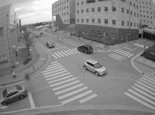
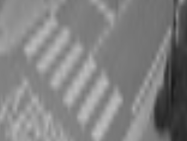

# INU-SmartLivingLabHakathon

## Description
Incheon National University SmartLivingLab Hakathon 대상

## Image Processing 

  
**Step.1** 학습의 차이를 줄이기 위한 이미지 흑백 처리 및 크롭  
**Step.2** 특정 부분을 얻기 위한 이미지 마스크 생성
  
## Model Download

https://drive.google.com/drive/folders/1ECjMMRsWi-nW_dcc2Yb6iKdJSMXwihe-?usp=sharing
